# Tech Team Tracker

A self-hosted, multi-organization GPS tracking platform for authorized field teams.
It combines a **native Android foreground tracking service**, a **TypeScript/PostgreSQL API**,
and a **responsive live web dashboard** — all deployable with `docker compose up -d`.

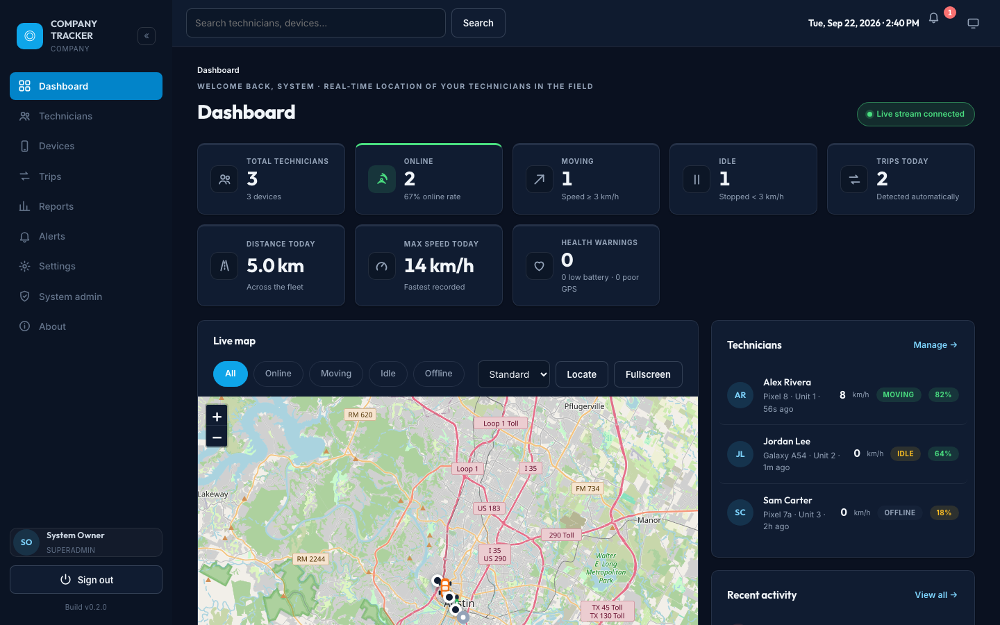

The product is generic: **all company branding is configurable** at runtime. This repository
ships with neutral `COMPANY` / `COMPANY TRACKER` example values only; no product code depends
on any company name.

[](docker-compose.yml)
[](#android-application)
[](#backend-api)
[](#web-dashboard)
[](#data-model)
[](LICENSE)

---

## Table of contents

- [Why this project](#why-this-project)
- [Features](#features)
- [Architecture](#architecture)
- [Quick start (Docker)](#quick-start-docker)
- [First-run setup](#first-run-setup)
- [Configure branding](#configure-branding)
- [Technicians, devices, and pairing](#technicians-devices-and-pairing)
- [Android application](#android-application)
- [How GPS tracking works](#how-gps-tracking-works)
- [Trips, stops, and route replay](#trips-stops-and-route-replay)
- [Dashboard tour](#dashboard-tour)
- [Screenshots](#screenshots)
- [Configuration reference](#configuration-reference)
- [API](#api)
- [Data model](#data-model)
- [Development](#development)
- [Testing](#testing)
- [Production deployment](#production-deployment)
- [Backups and restore](#backups-and-restore)
- [Security](#security)
- [Privacy](#privacy)
- [Multi-organization isolation](#multi-organization-isolation)
- [Troubleshooting](#troubleshooting)
- [Contributing](#contributing)
- [Roadmap](#roadmap)
- [License](#license)

---

## Why this project

Most GPS platforms are proprietary SaaS: your technicians' location history lives on someone
else's servers, and pricing scales with headcount. This project is a complete, self-hostable
alternative a company can run on a single Ubuntu server:

- **You own the data.** Everything stays in your PostgreSQL instance.
- **No vendor lock-in.** Open-source maps (OpenStreetMap) and a routing-ready design.
- **Transparent tracking.** The Android app always shows a visible *Tracking Active* notification. There is no stealth mode.
- **Multi-tenant from day one.** One installation can host many organizations with strict isolation.

## Features

**Tracking**
- Native Android foreground service; keeps recording with the screen off or while other apps are in use
- Adaptive GPS intervals (moving / stationary / low-battery) to protect battery life
- Offline-first: every point is stored in Room and uploaded when the network returns
- Idempotent uploads — point UUIDs make retries duplicate-free
- GPS quality flags (GOOD / FAIR / POOR) with impossible-jump and impossible-speed detection; raw points are **marked, never discarded**
- Battery, heading, accuracy, altitude, and network state recorded per point

**Trips & stops**
- Automatic trip detection from raw points (configurable stop timeout)
- Meaningful stop detection with arrival/departure times and durations
- Trip aggregates: distance, driving time, max/average speed, stop count, longest stop
- Full route history and animated route replay with 1×/2×/5×/10× speed and a timeline
- Raw GPS route preserved separately from any future map-matched route

**Operations dashboard**
- Live map with SSE streaming updates (no page refresh)
- Per-device vehicle icons (pin / car / motorcycle) with custom colors and live status rings
- Technician roster with online / moving / idle / offline status
- Device health: battery, GPS accuracy, last seen, app/Android version
- Trip history with date-range, week, month, and technician filters
- Daily / weekly / monthly reports with per-technician breakdowns
- Alerts: low battery, device offline, poor GPS
- Route replay player
- Light / dark / system theme; show/hide password toggles on every sign-in form
- Responsive layout for desktop, laptop, tablet, and mobile browsers

**Administration**
- Role hierarchy: `SUPERADMIN → ADMIN → MANAGER → DISPATCHER → TECHNICIAN`
- First-run setup wizard (no default `admin/admin` account exists)
- Superadmin **System Administration** area: organizations, users, audit log
- Superadmin password reset for any user (sessions revoked immediately, fully audited)
- Signed Android APK hosted on the server and downloadable from the About page
- Configurable branding: application name, company name, logo, favicon, colors, login background, support contact, timezone
- Configurable tracking and retention settings
- Complete audit trail (logins, device pairing, configuration changes, …)
- REST API with generated OpenAPI documentation

## Architecture

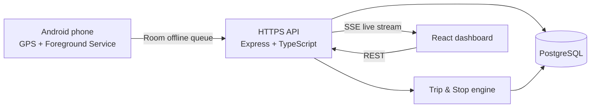
```mermaid
flowchart LR
    A[Android phone<br/>GPS + Foreground Service] -->|Room offline queue| B[HTTPS API<br/>Express + TypeScript]
    B --> C[(PostgreSQL)]
    B --> D[Trip & Stop engine]
    D --> C
    B -->|SSE live stream| E[React dashboard]
    E -->|REST| B
```

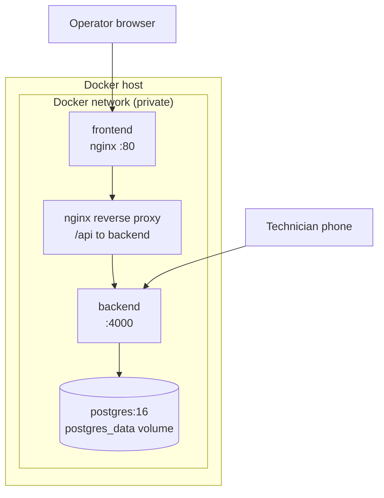
```mermaid
flowchart TB
    subgraph Host["Docker host"]
        subgraph net["Docker network (private)"]
            PG[(postgres:16<br/>postgres_data volume)]
            BE[backend<br/>:4000]
            FE[frontend<br/>nginx :80]
            Go[nginx reverse proxy<br/>/api to backend]
        end
        BE --> PG
        FE --> Go
        Go --> BE
    end
    Browser[Operator browser] --> FE
    Phone[Technician phone] --> BE
```

The backend is modular by domain: `auth`, `setup`, `organizations`, `users`, `technicians`,
`devices`, `locations`, `trips`, `reports`, `settings`, `dashboard`, `alerts`, `audit`, `health`.
Trip detection, GPS quality, and settings live in `backend/src/services/`.

## Quick start (Docker)

**Requirements:** Docker and Docker Compose. Nothing else — Node, PostgreSQL, and nginx all run in containers.

```bash
git clone <your-fork-url> tracker
cd tracker
cp .env.example .env
# Edit .env: set POSTGRES_PASSWORD, JWT_SECRET, JWT_REFRESH_SECRET
openssl rand -base64 48   # generate a strong secret

docker compose up -d --build
```

| Service      | URL                                    |
| ------------ | -------------------------------------- |
| Dashboard    | http://localhost:5788                  |
| API          | http://localhost:5789                  |
| API docs     | http://localhost:5789/api/docs         |
| OpenAPI JSON | http://localhost:5789/api/openapi.json |
| Health       | http://localhost:5789/health           |

Open the dashboard. Because the database is empty, you are redirected to the **first-run setup wizard**.

> The frontend nginx container proxies `/api` and `/health` to the backend, so the browser uses
> a single origin and no CORS configuration is needed. `API_PORT` is still published for mobile
> devices on your LAN.

## First-run setup

The setup wizard creates the organization, branding, and the **first superadmin**, then
permanently disables itself. There is no factory password.

1. Browse to http://localhost:5788 → the setup form appears automatically.
2. Enter company name, application name, superadmin name/email/password (minimum 12 characters).
3. Pick primary/secondary colors and timezone.
4. Choose **Initialize system**.

Verify the wizard is locked afterward:

```bash
curl -s http://localhost:5789/api/setup/status
# {"initialized":true,"applicationName":"..."}
```

**Optional development seed** (never for production): creates a demo superadmin from `.env`:

```bash
docker compose exec backend npm run seed
```

## Configure branding

Sign in as superadmin → **Settings → Branding**. Everything updates live:

| Setting | Effect |
| --- | --- |
| Application name | Dashboard title, browser tab, Android UI after config sync |
| Company name | Sidebar subtitle, login screen, reports |
| Logo / Favicon | Sidebar and browser tab icons |
| Primary / Secondary color | Applied instantly as CSS custom properties across the dashboard |
| Login background | Login screen backdrop |
| Support email / phone | Shown on the About page |
| Timezone / Country | Defaults for reports and display |

Example: `ACME TRACKER` / `ACME FIELD SERVICES` / `Asia/Manila`. Changing branding never requires a redeploy.

## Technicians, devices, and pairing

Technicians do **not** configure servers by hand. The administrator generates a short code:

1. **Technicians → Add technician** (name + employee number, e.g. `TECH-JUAN-001`).
2. **Pair device** → enter a device name → **Generate pairing code** (e.g. `7K4P-92MX`).
3. Install the Android app → enter the server URL and the pairing code → **Pair Device**.
4. The app stores a device token and starts uploading GPS points.

Pairing codes are:

- **Single-use** — reused or expired codes are rejected.
- **Time-limited** — they expire after 15 minutes.
- **Hashed at rest** — the database stores only a bcrypt hash.
- **Scoped** — a code is bound to one device UUID.

### Replacing a device

Phones get replaced, history must not be lost.

1. **Devices → Unpair** the old device (marks it `DISABLED`, clears the technician link).
2. Generate a new pairing code for a new device on the same technician.
3. Pair the new phone.

All historical GPS points, trips, and reports stay attached to the technician. The device
token is revoked at unpair, so the old phone can no longer upload.

### Removing a device or technician

Removal is deliberately two-step, because erasing a record would rewrite the location history
that reports and audits depend on.

1. **Remove** on a device or technician row. The API refuses with `409 Conflict` while the
   record still has GPS history, and the dialog lists exactly what would be lost (raw points,
   trips, alerts, linked devices).
2. Confirm **Erase history and remove** only if that history really is disposable — it is
   permanent and cannot be undone. Take a backup first if there is any doubt.

Records with no history delete immediately, without the second prompt. Related records are
handled for you:

- **Device** — pairing codes are dropped; alerts survive with their device link cleared.
- **Technician** — devices with no points are deleted, and any device still holding points is
  unpaired and disabled instead of destroyed so its points keep their attribution.

If you only want to stop tracking someone without touching their history, **Unpair** the
device or **Deactivate** the technician instead.

## Android application

Open `android/` in Android Studio (Android SDK 35, JDK 17), then **Build → Make Project** and
run on a physical device. Android Studio generates the Gradle wrapper on first sync.

Configuration:

- **Emulator:** server URL `http://10.0.2.2:5789`
- **Physical device:** the server's LAN address or HTTPS domain, e.g. `https://tracker.example.com`
- Cleartext HTTP is enabled for local testing; use HTTPS in production.

Screens: **Splash → Pairing → Home (tracking status) → Live map → Trip history → Trip
details → Route playback → Notifications → Settings → More → About**, with a four-item
bottom navigation (Home · Map · Trips · More).

Permissions required: fine location (and *Allow all the time* for background tracking) and
notifications. The app requests them on first start.

### Interface

The UI is Jetpack Compose with a small design system, so the technician gets one consistent
product rather than default Material screens. Two surfaces are used deliberately: a dark
"field shell" for the splash and the tracking dashboard (read at a glance, often outdoors)
and a light workspace for maps, lists and settings.

- **Home** — one glowing status indicator, then current speed, GPS accuracy, last update
  and battery, with today's distance, trip count and offline queue below it. Stop tracking
  is the only red control.
- **Live map** — full-screen map with the recorded route, start and end markers, the live
  position, floating stats card and centre / zoom / layer controls.
- **Trips** — day, week and month filters with a date stepper, numbered trip cards.
- **Trip details** — the route the technician actually drove, with distance, driving time,
  max and average speed, stops and GPS point count, plus play route and share.
- **Route playback** — scrubbable timeline, 1×/2×/4× speeds, interpolated time, speed and
  location readouts as the marker moves along the recorded track.
- **Notifications** — tracking, trip, battery and upload events derived from real recorded
  data (there is no mock feed).
- **Settings** — tracking, account and application groups. Only controls that map to real
  behaviour are interactive; server-configured values are shown read-only.

Interface modules:

| Path | Responsibility |
| --- | --- |
| `ui/Theme.kt` | Design tokens, typography, light/dark schemes |
| `ui/TrackerIcons.kt` | Custom outline icon set (drawn, not a multi-megabyte asset pack) |
| `ui/Components.kt` | Cards, status pills, metric tiles, buttons, dialogs, skeleton loaders |
| `ui/TrackerMap.kt` | Shared osmdroid map with route overlays and controls |
| `ui/TrackingState.kt` | Read-only snapshot of what the technician sees |
| `ui/TrackerApp.kt` | Navigation host and system bar theming |
| `ui/screens/*` | One file per screen |

Behaviour modules (unchanged by UI work):

| File | Responsibility |
| --- | --- |
| `TrackingService.kt` | Foreground service, adaptive intervals, visible notification |
| `TripDetector.kt` | On-device trip/stop state mirror |
| `LocationEntity.kt` | Room database and DAO (offline queue) |
| `SyncWorker.kt` | Idempotent batch upload with retry/backoff |
| `SyncScheduler.kt` | Periodic + opportunistic sync scheduling |
| `TrackerApi.kt` | Device config, trip, and route client |
| `TrackerPrefs.kt` | Encrypted credential storage |
| `PairingManager.kt` | Pairing handshake |
| `BatteryMonitor.kt` | Battery level and charging state |
| `BootReceiver.kt` | Resume tracking after reboot |
| `MainActivity.kt` | Permissions, pairing, service start/stop, sign out |

### Branding the app

The application name shown in the header, the splash screen and the tracking notification
comes from the configured branding on the server, so renaming it in the dashboard is enough.
Before pairing there is nothing to ask the server, so the app falls back to the strings in
`app/src/main/res/values/strings.xml` (`app_name`, `app_tagline`, `brand_footer_title`,
`brand_footer_subtitle`). Edit those to change the pre-pairing name, tagline and footer —
no Kotlin changes required.

## How GPS tracking works

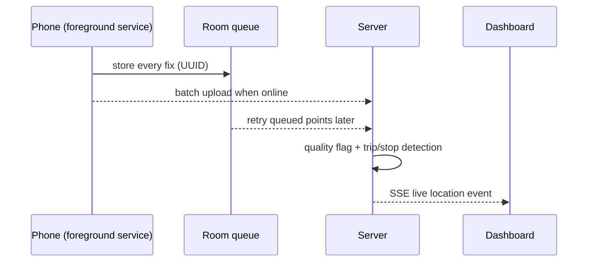
```mermaid
sequenceDiagram
    participant P as Phone (foreground service)
    participant R as Room queue
    participant S as Server
    participant D as Dashboard
    P->>R: store every fix (UUID)
    P-->>S: batch upload when online
    R-->>S: retry queued points later
    S->>S: quality flag + trip/stop detection
    S-->>D: SSE live location event
```

1. The foreground service requests locations from the Fused Location Provider.
2. Each fix is written to Room immediately, with battery/heading/accuracy/network state.
3. Intervals adapt: moving (fast), stationary (slow), low battery (slowest, balanced power).
4. `SyncScheduler` uploads batches (`POST /api/locations/batch`) whenever a network is available.
5. If the network drops, points keep accumulating locally and upload when it returns.
6. Point UUIDs make uploads idempotent — a retried batch never duplicates data.
7. The server classifies quality, marks impossible jumps, updates live state, and runs trip detection.

## Trips, stops, and route replay

- A trip **starts** on first sustained movement and **ends** after the configured stationary
  timeout (default 300 seconds).
- Stops shorter than the threshold inside a trip are recorded as **stops** with arrival and departure times.
- Because points are uploaded in batches, trips are detected on the server whenever new points
  arrive; admins can also force detection for a window with `POST /api/trips/process`.
- `GET /api/trips/:id/route` returns the **raw** GPS trace. `GET /api/trips/:id/replay` returns a
  timeline annotated with elapsed seconds and cumulative distance for playback.

Sample trip history (September 21, 2026):

| Trip | Time | Distance | Duration |
| --- | --- | --- | --- |
| #4 | 4:12 PM – 4:38 PM | 12.8 km | 26 min |
| #3 | 1:15 PM – 2:02 PM | 18.6 km | 47 min |

## Dashboard tour

The shell has a **breadcrumb trail** for the current route and a **collapsible sidebar**
(icons only when collapsed; the preference is remembered per browser).

| Page | What it shows |
| --- | --- |
| **Live tracking** | Summary counters, live map, technician roster, click-through to a technician |
| **Technicians** | Roster, add technician, generate pairing codes, open detail |
| **Technician detail** | Today's distance/trips/driving time, GPS route, devices, recent trips |
| **Devices** | Health table (online/delayed/offline), battery, GPS accuracy, build versions, unpair/re-pair |
| **Trips** | Filter by technician and date range, grouped by day, totals |
| **Trip detail** | Start/end, distance, speeds, stops, route map, replay player |
| **Reports** | Daily / weekly / monthly totals and per-technician breakdown |
| **Alerts** | Low battery, poor GPS, offline devices; acknowledge to clear |
| **Settings** | Branding, tracking intervals, retention, account password, server status |
| **System admin** | *(superadmin)* organizations, users, audit log |
| **About** | Product, privacy, support contact, API docs link |

## Screenshots

> Captured from a running instance with fictional demo data (Austin, TX). Regenerate with
> `docker compose exec backend npm run seed:shots` followed by
> `node scripts/capture-screenshots.mjs` — see [`docs/screenshots/README.md`](docs/screenshots/README.md).

| | |
| --- | --- |
| 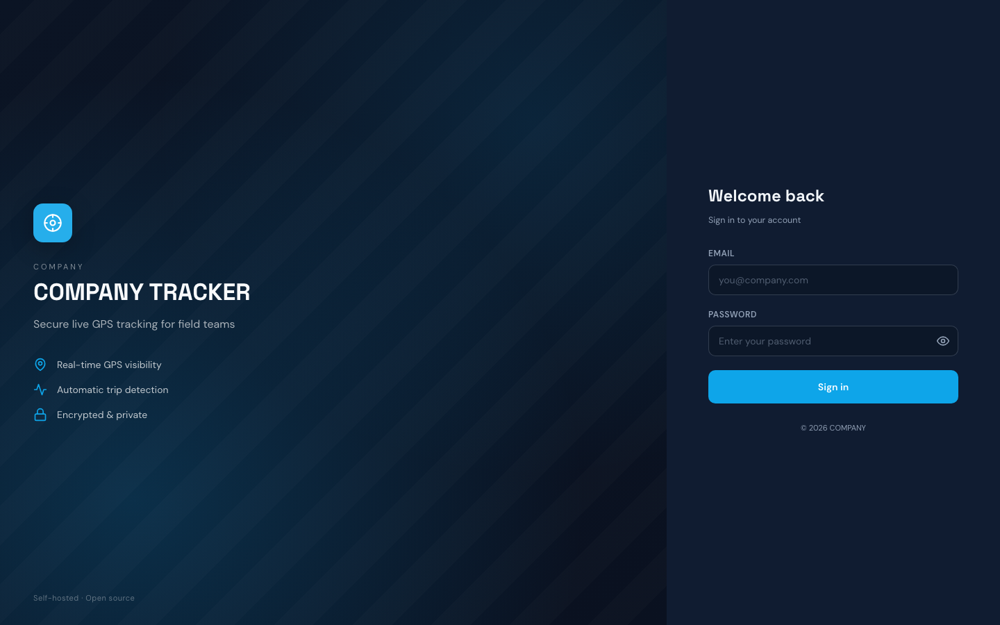 |  |
| **1. Login** — branded sign-in | **2. Dashboard** — summary + live map |
| 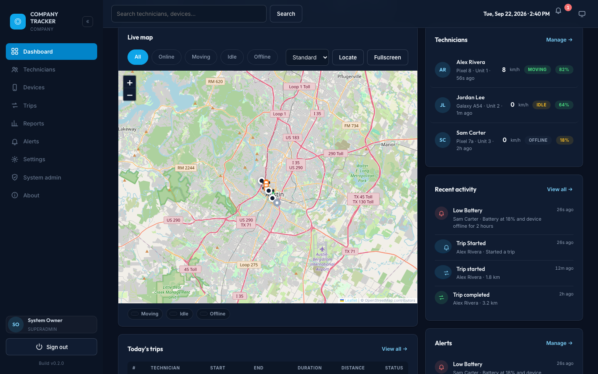 | 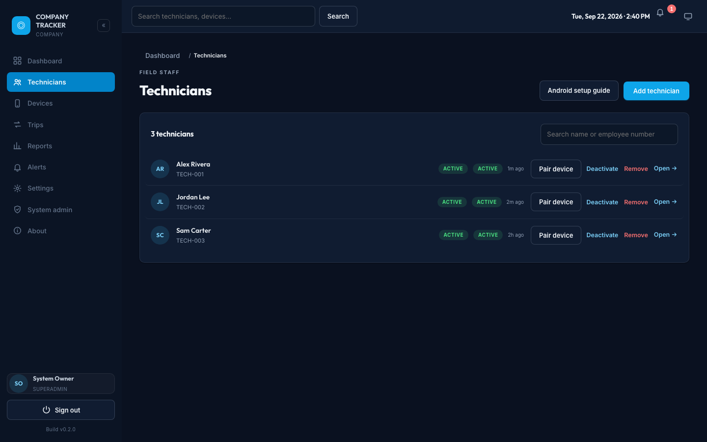 |
| **3. Live map** — all technicians | **4. Technician list** |
| 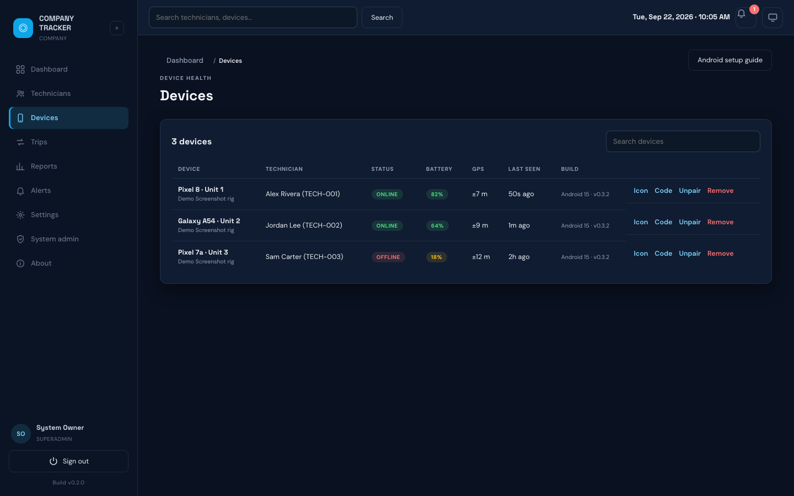 | 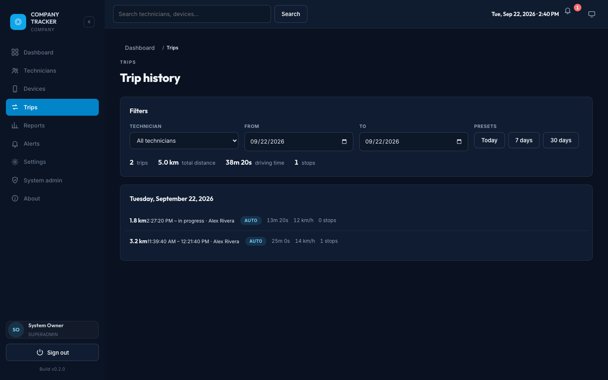 |
| **5. Device management** | **6. Trip history** |
| 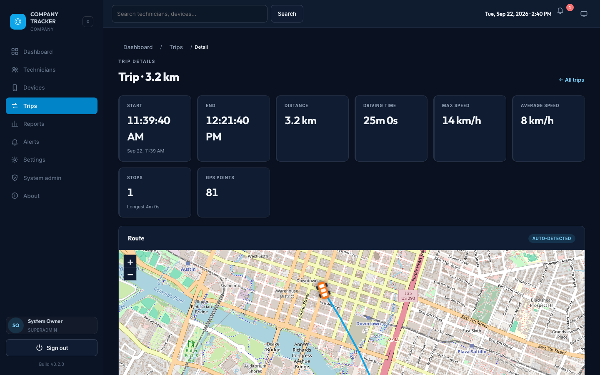 | 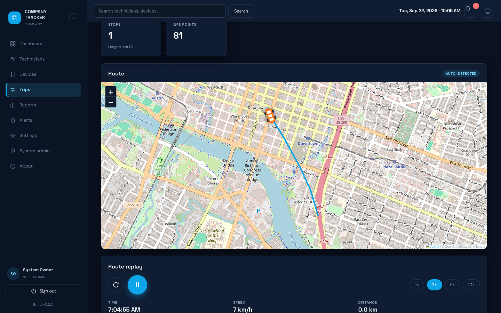 |
| **7. Trip details** | **8. Route replay** |
| 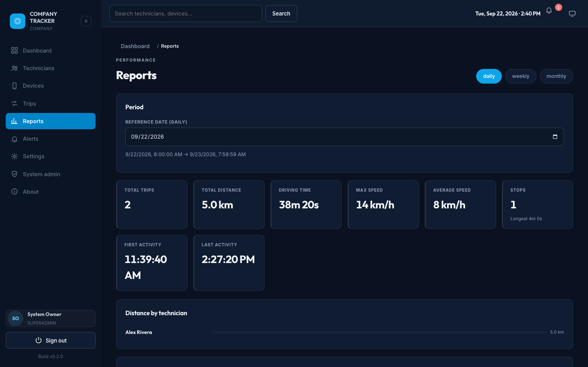 | 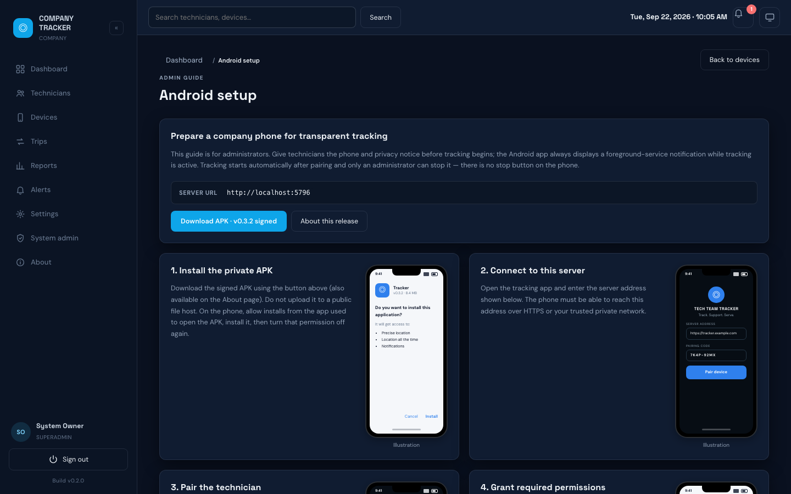 |
| **9. Daily report** | **10. Android setup guide** |
| 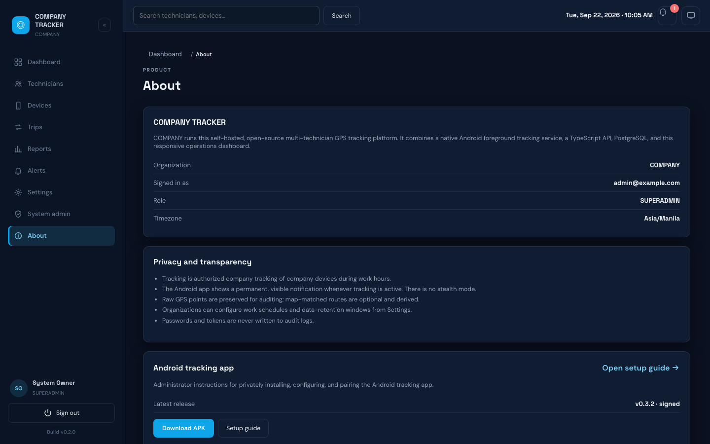 | 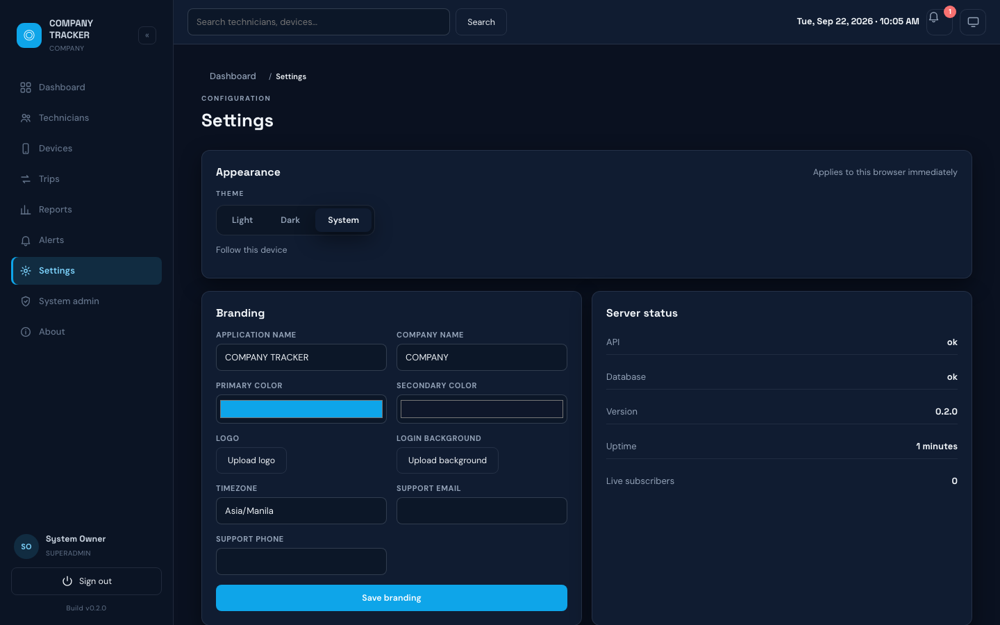 |
| **11. About + APK download** | **12. Settings** |
| 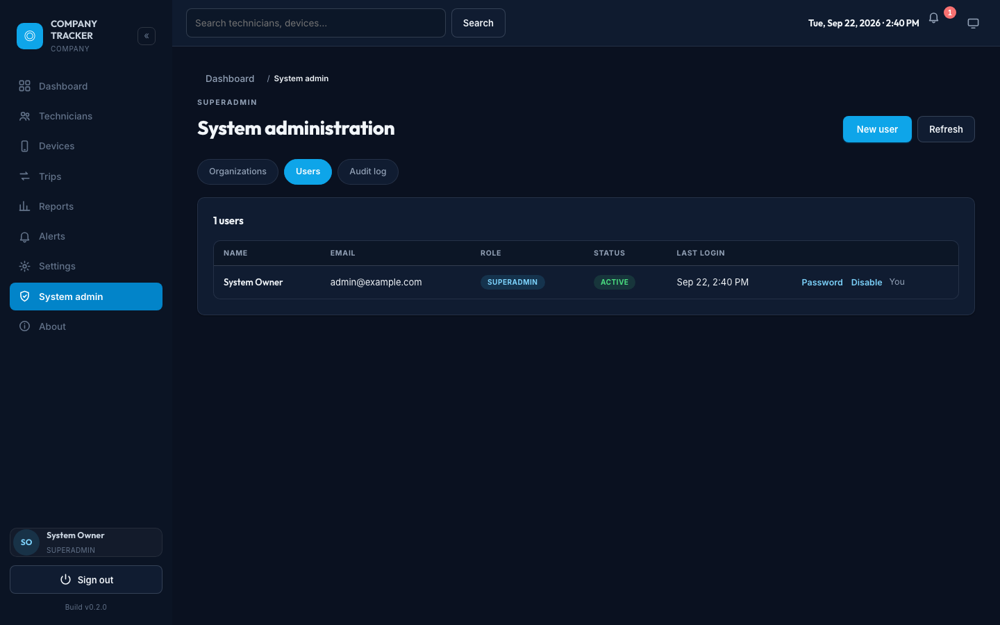 | 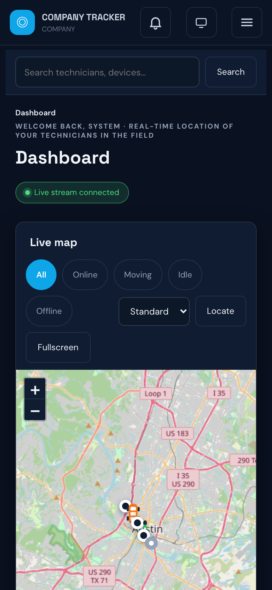 |
| **13. Superadmin system administration** | **14. Mobile dashboard** |
| 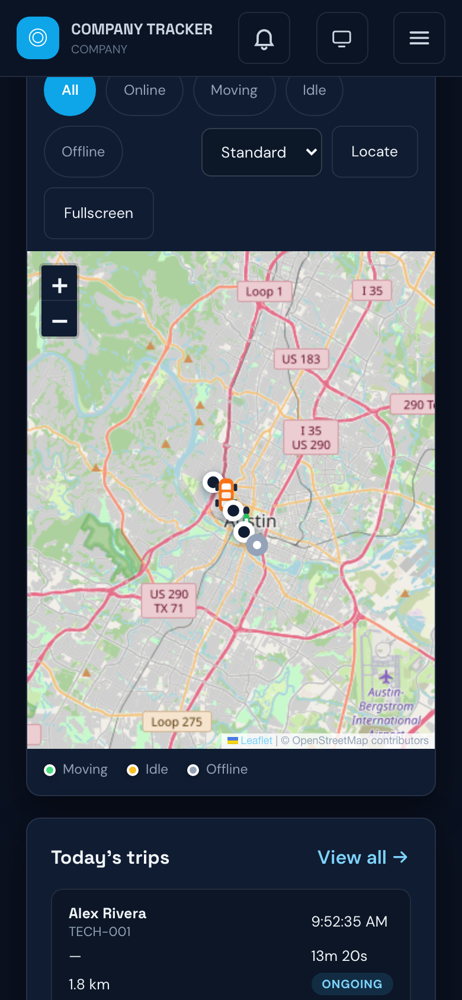 | 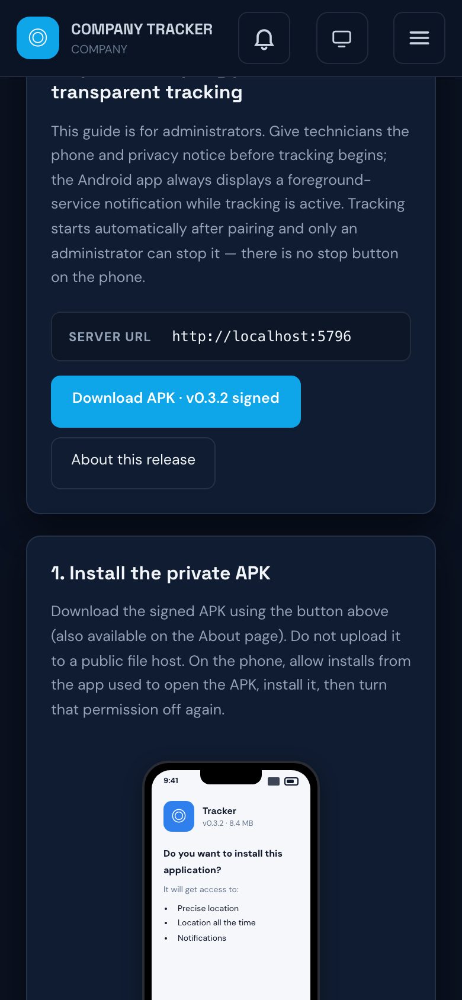 |
| **15. Mobile live map** | **16. Mobile setup guide** |

## Configuration reference

All configuration is environment-driven. See [`.env.example`](.env.example).

| Variable | Purpose | Default |
| --- | --- | --- |
| `POSTGRES_DB` / `POSTGRES_USER` / `POSTGRES_PASSWORD` | Database credentials | `tracker` / `change-me` |
| `DATABASE_URL` | Prisma connection string | internal `postgres` host |
| `JWT_SECRET` | Access-token signing key (**required**) | dev placeholder |
| `JWT_REFRESH_SECRET` | Refresh-token signing key (**required**) | dev placeholder |
| `ACCESS_TOKEN_TTL` | Access-token lifetime | `15m` |
| `REFRESH_TOKEN_DAYS` | Refresh-token lifetime | `30` |
| `API_PORT` / `FRONTEND_PORT` | Host ports | `5789` / `5788` |
| `CORS_ORIGIN` | Allowed browser origins (comma-separated) | `http://localhost:5788` |
| `VITE_API_URL` | API base URL baked into the dashboard build (empty = same origin) | *(empty)* |
| `DEFAULT_*` | Fallback branding before an organization configures its own | `COMPANY` etc. |
| `SEED_*` | Optional development seed account | — |
| `NODE_ENV` | Runtime mode | `production` |

Never commit `.env`, signing keys, production URLs, or certificates.

## API

Interactive docs: **`/api/docs`** · machine-readable spec: **`/api/openapi.json`**

Selected endpoints:

```
POST   /api/setup                          first-run initialization
POST   /api/auth/login                     sign in (returns access + refresh tokens)
POST   /api/auth/refresh                   rotate refresh token
POST   /api/auth/logout                    revoke refresh token
GET    /api/auth/me                        current profile
POST   /api/auth/change-password

GET    /api/organizations                  superadmin: list organizations
POST   /api/organizations                  superadmin: create organization
GET    /api/users                          list users
POST   /api/users                          create user
GET    /api/technicians                    list technicians
POST   /api/technicians                    create technician
GET    /api/technicians/:id                detail + today's totals
GET    /api/technicians/:id/locations      raw GPS history
GET    /api/technicians/:id/trips          trip history
DELETE /api/technicians/:id                remove (409 while history exists)
DELETE /api/technicians/:id?purge=true     remove and erase their GPS history

POST   /api/devices/pairing-code           generate a single-use code
POST   /api/devices/pair                   pair a phone (public)
POST   /api/devices/:id/unpair             unpair (history preserved)
DELETE /api/devices/:id                    remove (409 while history exists)
DELETE /api/devices/:id?purge=true         remove and erase the device's points
GET    /api/device/config                  device-token config (intervals/branding)
POST   /api/locations/batch                upload GPS points (device token)

GET    /api/dashboard/live                 live device positions
GET    /api/dashboard/summary              counters
GET    /api/dashboard/stream               Server-Sent Events stream
GET    /api/trips                          filtered trip list
GET    /api/trips/:id                      trip detail
GET    /api/trips/:id/route                raw GPS route
GET    /api/trips/:id/replay               replay timeline
GET    /api/trips/:id/stops                detected stops
POST   /api/trips/process                  force detection over a window

GET    /api/reports/daily|weekly|monthly   reports
GET    /api/settings                       branding
POST   /api/settings                       update branding
GET/PUT /api/settings/tracking             adaptive interval settings
GET/PUT /api/settings/retention            retention windows
GET    /api/alerts                         alerts
POST   /api/alerts/:id/acknowledge         acknowledge
GET    /api/audit-logs                     audit trail
POST   /api/maintenance/retention          apply retention now
GET    /health, /health/database, /health/version
```

Two distinct token types are used: **user sessions** (JWT + rotating refresh token) for the
dashboard, and **device tokens** for phones. A device token can only read its own config and
upload GPS points; it is rejected from every management endpoint (and vice versa).

## Data model

```
Organization ─┬─ User ── RefreshToken
              ├─ Branding / TrackingSetting / RetentionSetting
              ├─ Technician ─┬─ Device ── PairingCode
              │              ├─ Location
              │              └─ Trip ── TripStop
              └─ Alert / AuditLog
```

Key constraints:

- `Location` has a unique `(deviceId, recordedAt)` index → idempotent ingestion and fast range scans.
- Indexes on `(organizationId, recordedAt)` and `(technicianId, recordedAt)` keep history and report queries efficient.
- Migrations live in `backend/prisma/migrations/`; the container applies them on start.

## Development

```bash
# Backend
cd backend
npm install
cp ../.env.example .env      # then point DATABASE_URL at localhost
npx prisma migrate deploy
npm run dev                  # tsx watch

# Frontend
cd frontend
npm install
VITE_API_URL=http://localhost:4000 npm run dev
```

Conventions: TypeScript strict mode, Zod validation on every request body, environment
variables for all configuration, database migrations (never manual schema edits), and
domain-oriented modules instead of one large file.

## Testing

```bash
cd backend && npm test        # GPS math, quality flags, trip/stop detection, tokens

# Full API acceptance test (requires a running stack + a bootstrapped admin)
bash scripts/e2e-api.sh
```

`scripts/e2e-api.sh` verifies health, setup state, login + refresh, technician setup,
single-use pairing, **device-token isolation**, GPS upload, idempotency, live dashboard,
automatic trip detection, route, replay, reports, settings, audit, alerts, device config,
history-preserving device replacement, and guarded technician/device removal (`409` refusals
plus explicit `?purge=true` erasure).

```bash
# Browser acceptance test (headless Chrome over the DevTools Protocol)
node scripts/e2e-browser.mjs
```

`scripts/e2e-browser.mjs` drives a real Chrome and verifies:

- the login form signs in with a real account
- every sidebar entry navigates to the expected page
- breadcrumbs reflect the current route
- the sidebar collapse/expand toggle works and persists across reloads
- deep links (`#/trips`, a full reload on `#/reports`) render directly
- a technician can be created and a pairing code generated through the UI
- removing a **technician or device that has GPS history** is refused once (listing what
  would be erased), then succeeds after an explicit second confirmation
- a worst-case technician row (long name, phone, paired device, all four actions) still fits
  a phone screen
- **no console errors, uncaught exceptions, or same-origin request failures** on any page
- **no horizontal layout overflow** at desktop (1440×900) and mobile (390×844); failures
  name the offending element

Requires Chrome; set `CHROME_PATH` if it is not in a standard location. The run creates a
technician with a timestamped employee number, so point it at a development stack.

## Production deployment

See **[docs/DEPLOYMENT.md](docs/DEPLOYMENT.md)** for a full Ubuntu walkthrough: Docker install,
domain, HTTPS via a reverse proxy, firewall rules, updates, rollback, monitoring, and logs.

Short version:

```bash
# on the server
git clone <your-fork-url> /opt/tracker && cd /opt/tracker
cp .env.example .env   # set strong secrets and CORS_ORIGIN=https://tracker.example.com
docker compose up -d --build
docker compose logs -f backend
```

Put a reverse proxy with HTTPS in front of port 5788, keep PostgreSQL unpublished (it already is),
and open only 80/443 externally.

## Deploying your own copy

This repository is meant to be forked per deployment — one fork, one company, one server:

```bash
git clone <your-fork-url> && cd tech-team-tracker
cp .env.example .env   # set POSTGRES_PASSWORD, JWT_SECRET, JWT_REFRESH_SECRET, CORS_ORIGIN
docker compose up -d --build
# open the dashboard and complete the first-run setup wizard (branding, superadmin)
```

Then make it yours from **Settings → Branding** (application/company name, logo, colors, login
background, support contact, timezone). No code change or redeploy is needed for branding.

## Updating the Android app

Each deployer signs their own APK — the signing key must stay private to you:

```bash
# one time: generate android/release.keystore + android/local.properties (both gitignored)
cd android
JAVA_HOME=<jdk-17> ANDROID_HOME=<sdk> ./gradlew assembleRelease
cp app/build/outputs/apk/release/app-release.apk ../frontend/public/tracker.apk
# bump the version labels in About.tsx / AndroidSetup.tsx, then:
docker compose up -d --build frontend
```

**Back up `android/release.keystore` and its passwords.** Losing them means phones can never be
updated in place — the app must be uninstalled and reinstalled. Never commit the keystore;
`*.jks`, `*.keystore`, and `local.properties` are already gitignored.

## Backups and restore

GPS history is business-critical. See **[docs/BACKUP.md](docs/BACKUP.md)** and the helper scripts:

```bash
bash scripts/backup.sh              # pg_dump into ./backups/tracker-<timestamp>.sql.gz
bash scripts/restore.sh backups/tracker-20260921-0300.sql.gz
```

Schedule `scripts/backup.sh` with cron and **test a restore** before you need one.

## Security

- HTTPS termination at the reverse proxy; secrets only in `.env`
- bcrypt password hashing (cost 12); no plaintext credentials anywhere
- Short-lived access tokens with rotating, revocable refresh tokens
- Role-based access control plus organization-level data isolation
- Device tokens are strictly separated from user sessions
- Rate limiting on all routes, with a stricter window for login/refresh/pairing
- Request validation and input sanitization via Zod on every endpoint
- Helmet security headers, configurable CORS, JSON body-size limits
- Single-use, expiring, hashed pairing codes; device tokens revoked on unpair
- Audit logging of authentication and administrative actions (never secrets)
- No secrets shipped in the Android app

Report vulnerabilities privately — see [SECURITY.md](SECURITY.md).

## Privacy

Read [docs/PRIVACY.md](docs/PRIVACY.md). In short:

- Tracking is **transparent**: the app always shows a persistent notification, and the technician can stop it.
- No stealth/hidden tracking is implemented.
- Organizations should publish notice, define work schedules, and configure retention windows.
- Coordinate data is personal data. Configure retention, restrict dashboard access, and back up securely.

## Multi-organization isolation

The data model and API are multi-tenant: a user from Organization A can never read
Organization B's technicians, devices, locations, trips, reports, or alerts. Every query is
scoped by `organizationId` (`orgScope()` in `backend/src/common.ts`); only `SUPERADMIN` sees
across organizations. The API acceptance test asserts that a device token cannot read
management endpoints.

## Troubleshooting

| Symptom | Fix |
| --- | --- |
| Dashboard shows "Starting tracker…" forever | Backend not reachable. Check `docker compose logs backend` and `/health`. |
| `database` health is `unavailable` | PostgreSQL still starting or `DATABASE_URL` wrong. Wait for the healthcheck, then re-run. |
| Android app cannot pair | Codes expire after 15 minutes and are single-use — generate a new one. Check the phone can reach the server URL. |
| Tracking stops when the screen locks | Grant **Allow all the time** location permission and disable OEM battery restrictions for the app. |
| No live updates | Some corporate proxies buffer SSE. The dashboard falls back to polling every 20 seconds. |
| Setup wizard says "already initialized" | The system was seeded. Sign in, or reset the `SystemState` row in a development database. |
| `Too many requests` (429) | Rate limiter hit. Wait a minute; tune limits in `backend/src/middleware/rateLimit.ts`. |

## Contributing

Issues and pull requests are welcome. Please read [CONTRIBUTING.md](CONTRIBUTING.md). Run
`npm test` in `backend/` and `npx tsc --noEmit` in both packages before opening a PR.

## Roadmap

The architecture already anticipates: Repair Tracker / work-order integration, customer
geofences with automatic arrival/departure, technician ETA, work schedules and shift tracking,
speed/route-deviation/driver-behavior alerts, QR device pairing, push/email/Telegram
notifications, a mobile admin app, webhooks, fleet/vehicle assignment, and self-hosted
map-matching (OSRM / GraphHopper / Valhalla).

Not yet implemented and explicitly deferred: self-hosted map matching, a Redis-backed event bus,
email/push delivery, and geofence automation.

## License

MIT — see [LICENSE](LICENSE).
